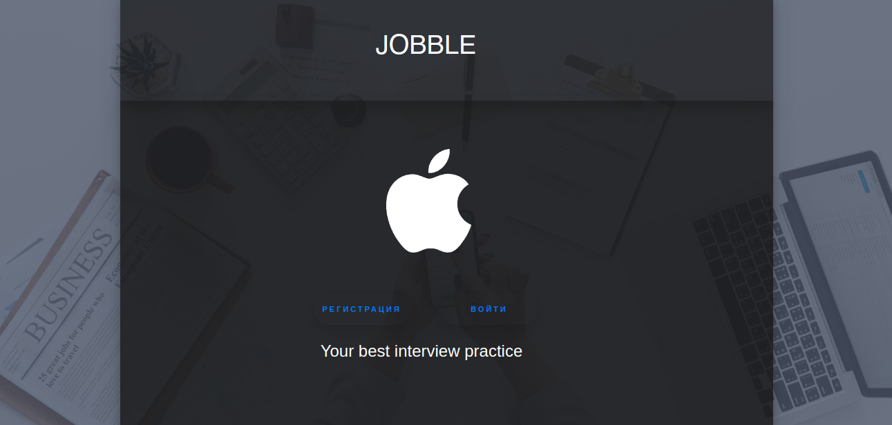
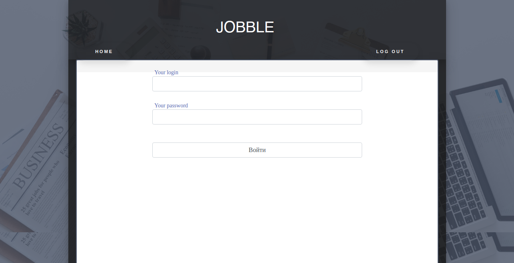
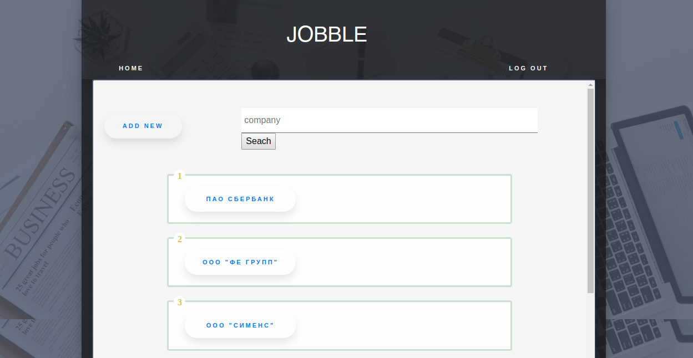
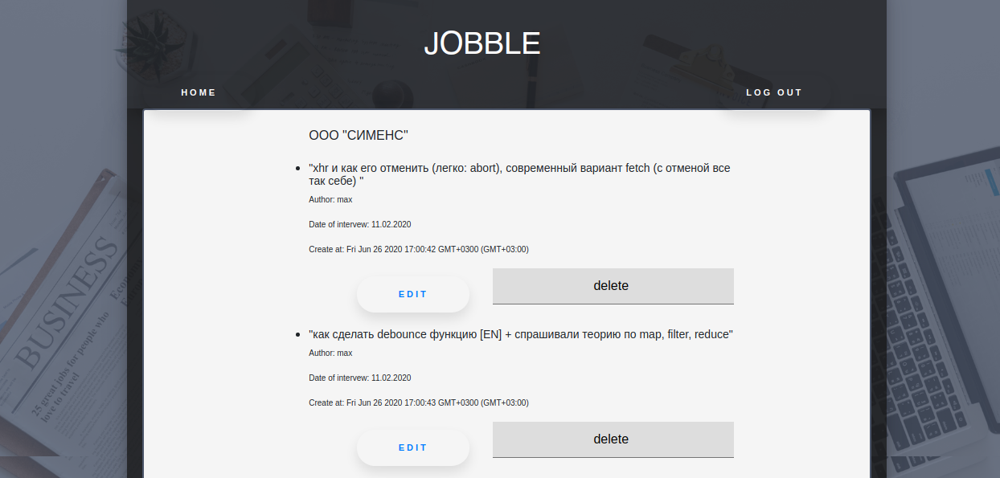

<h2> <strong> Jobble - Intreview practice </strong> </h2> 
   v 1.0.0

  

<h4><strong>Над проектом работали: </strong></h4>
<ul>
<li>Владимир Федасов</li>
<li>Евгений Константинов</li>
<li>Максим Гиленко</li>
<ul>

<h4> <strong> Что это? </strong></h4>

Сайт для студентов и выпускников Elbrus Bootcamp, которые находятся в активном поиске работы.

<h4> <strong> Зачем? </strong></h4>

Основная цель: обмен опытом при прохождении собеседований в различные IT компании. 

Если рассказать подробнее, то у большинства junior разработчиков возникают проблемы с прохождением интервью. Не то чтобы они совсем ничего не знают, но пройти собеседование - это отдельный этап в жизни каждого начинающего (и не только) специалиста, к которому нужно подготовиться.
Jobble предлагает обмен интересными вопросами, нестандартными задачами и прочими тонкостями, которые бывают в различных компаниях. 

<h4> <strong> Подробнее </strong> </h4>

Вот такой пример. Вася получил приглашение в СБЕРБАНК и завтра едет на собеседование. Он заходит в Jobble и находит там СБЕРБАНК. Смотрит, что Коля и Петя были на этом интервью несколько месяцев назад, они поделились вопросами и своими техническими заданиями. Плюс оставили небольшие комментарии, например что HR Анастасия любит чувство юмора и обращает внимание не только на опыт в сфере IT, а и на предыдущий практический опыт и достижения. Теперь у Васи есть возможность подготовиться более качественно, хотя это вовсе не гарантирует ему трудоустройство.
 
Кстати, после завершения интервью, Вася и сам не против поделиться своим опытом с другими. 

<h4> <strong> Какие технологии использовали? </strong> </h4>

<h4> # Mongo DB </h4>

Для хранения данных 

<h4> # Express </h4>

Для серверной части 

<h4> DaData API </h4>

Для подключения единой базы компаний РФ 

<h4> Trello + Slack </h4>

Для построения более качественной командной работы 

<h4> <strong> Как запустить ? </strong></h4>
<ul>
<li> Клонируйте репозиторий на свой компьютер </li>
<li> Воспользуйтесь командой: </li>
     
    
npm install 

    
npm start 

<li> Запустите приложение на своей локальной машине </li>
</ul>

<h4> <strong> Скриншоты Jobble </strong></h4>

  

  

  

<h4> Спасибо, что посмотрели наш проект! Хорошего дня! =) </h4>
